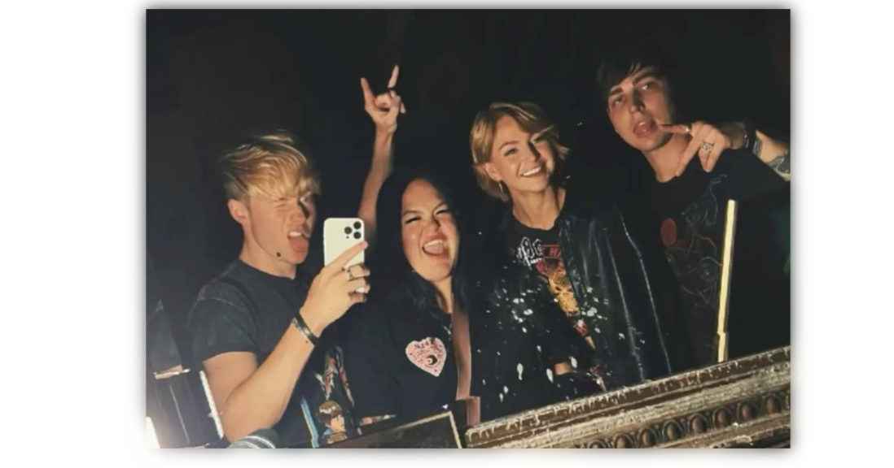

$\color{#b53535}{\textbf{freaky just got fabulous?}}$

[sam](https://github.com/ChromaDrift) . [celina](https://github.com/verifiedreality) . [kris](https://github.com/yurivampire) . [colby](https://github.com/stellariism)

$\color{#672020}{\textbf{new readme because its hellweek}}$

[0_0](https://linktr.ee/karinacchi) [?](https://youtu.be/Wvj_DuV1sbQ?si=vh3nnXGHvUDhI7xa) [^_^](https://youtu.be/ybyPB9x8HXc?si=XmdUxSP6xhMOjFoA)

 

<!---
yurivampire/yurivampire is a ✨ special ✨ repository because its `README.md` (this file) appears on your GitHub profile.
You can click the Preview link to take a look at your changes.
--->
