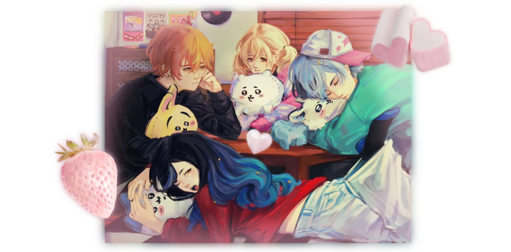

< [akito](https://github.com/ChromaDrift) . [kohane](https://github.com/verifiedreality) . [an](https://github.com/yurivampire) . [toya](https://github.com/stellariism) 3

[CUTE FAT TREE](https://linktr.ee/karinacchi) 

[fio :3](https://github.com/your-reader) [DAUGHTER](https://github.com/PraiseThe-Fool) [my DAD (warning: fruity) ](https://github.com/venzqs)  [meowse?](https://github.com/miiyase) 

[BRI <3 lil sis](https://github.com/YuriKitten) [legendary meower](https://github.com/youthintheshade) [marcus](https://github.com/internet-angel-kangel) [MAISIE!!!](https://github.com/STAIRIXX) 

$\color{#cea3da}{\textbf{da friend Links click to view yes they are so few goddamn it}}$

 

<!---
yurivampire/yurivampire is a ✨ special ✨ repository because its `README.md` (this file) appears on your GitHub profile.
You can click the Preview link to take a look at your changes.
--->
